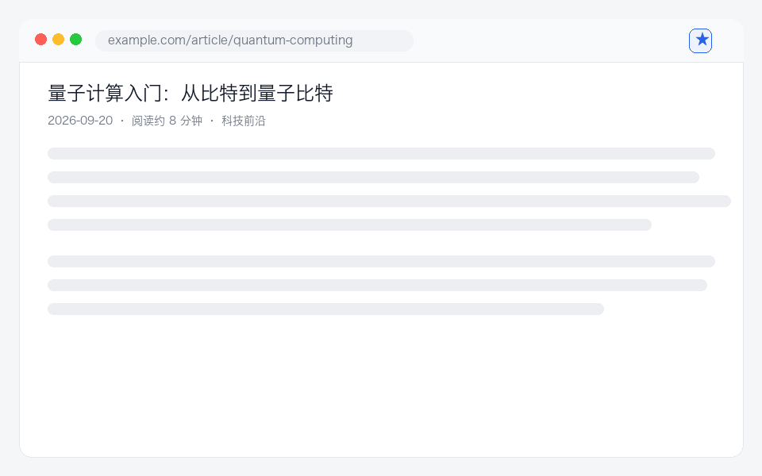

# ClipKeep ★

> **零账号 · 纯本地 · 跨浏览器** 的轻量划词收藏插件。

[](https://liuxin1985.github.io/ClipKeep/)
[](CHANGELOG.md)

在任意网页划选文字 → 一键存本地 → 高亮批注 → 每日回顾 → 导出 Markdown → 净化阅读。
学生整理网课重点、上班族留存周报素材，开箱即用，无后端、无广告、不上传任何数据。

**划词 → 收藏 → 回顾 → 导出，四步闭环：**



---

## ✨ 为什么选 ClipKeep

- **一键即用**：装上就能划词收藏，无需注册、无需配置。
- **纯本地离线**：所有数据存在浏览器 `storage.local`，永不离开你的设备。
- **跨三浏览器**：Chrome / Edge / Safari 16.4+ 全支持（同一套代码 + Safari 适配层）。
- **划词高亮 + 原文批注**：在网页上直接涂色、写批注，下次打开自动重放，点击即可修改或删除。
- **每日回顾**：内置 Leitner 间隔重复（0/1/3/7/21/90 天），收藏不再只进不出。
- **JSON 备份 / 恢复**：换电脑、换浏览器一键迁移，按 id 合并不会覆盖本地数据。
- **导出 Markdown**：单条或批量导出，方便归档到 Obsidian / Notion / GitHub。
- **净化阅读**：一键移除广告、侧边栏、导航，只留正文。
- **标签分类 + 深色模式 + 一键复制**：高频小功能全覆盖。

##  快速开始（3 步）

1. 下载 / clone 本仓库。
2. 打开 `chrome://extensions`，右上角开启 **开发者模式**。
3. 点 **加载已解压的扩展程序**，选择 `extension/` 目录。

> 详细分浏览器安装说明见 [docs/INSTALL.md](docs/INSTALL.md)。

## 🧑‍ 使用方式

| 操作 | 方法 |
| --- | --- |
| 划词收藏 | 选中文字 → 浮动条点「★ 收藏」→（可加备注/标签）保存 |
| 划词高亮 | 选中文字 → 浮动条点「🖍」→ 页面即刻涂色，刷新后自动恢复 |
| 原文批注 | 选中文字 → 浮动条点「✎」→ 写批注（粉色高亮）；点击已有高亮可改可删（输入 `d` 删除） |
| 每日回顾 | 弹窗切到「🔁 回顾」→ 看题干 →「显示答案」→ 忘记 / 记得 / 简单，自动排下次时间 |
| 备份 / 恢复 | 弹窗底部「备份」导出 JSON；「恢复」选择该文件按 id 合并回本地 |
| 右键收藏 | 选中文字 → 右键 → 「ClipKeep：收藏选中内容」 |
| 净化阅读 | 浮动条点「阅读」/ 右键「净化阅读本页」/ 弹窗 📖 |
| 查看/搜索/筛选 | 点工具栏图标打开弹窗 |
| 导出 | 弹窗右上 ⬇ 导出全部，或单条「导出」 |
| 深色模式 | 弹窗右上 🌙 / ☀️ 切换 |

## 📁 项目结构

```
ClipKeep/
├── README.md
├── LICENSE                 # MIT
├── CHANGELOG.md
├── package.json            # 仅测试用（jsdom），扩展本身零依赖
├── docs/
│   ├── index.html             # GitHub Pages 在线演示页
│   ├── clipkeep-dev-plan.md   # 完整开发规划与 30 天里程碑
│   ├── INSTALL.md
│   ├── CONTRIBUTING.md
│   ├── ISSUE_TEMPLATES.md
│   ├── ci/workflow-test.yml   # 拷到 .github/workflows/ 即开启 CI
│   └── demo.gif
├── test/
│   └── clipkeep.test.mjs      # 58 项断言：消息路由 / 间隔重复 / 备份恢复 / 高亮重放
└── extension/              # 可直接加载的插件目录
    ├── manifest.json          # MV3（Chrome / Edge）
    ├── manifest.safari.json   # Safari 适配清单
    ├── background.js          # Service Worker：菜单 / 存储 / 消息路由
    ├── content.js             # 划词工具条 / 收藏卡片 / 高亮批注 / 净化阅读
    ├── content.css
    ├── popup.html / popup.css / popup.js   # 收藏 + 回顾 / 搜索 / 标签 / 导出 / 备份 / 深色
    └── icons/                 # 16 / 48 / 128
```

## 🛠 技术栈

原生 JavaScript + 浏览器 Extension API（Manifest V3）+ 手写 CSS（清爽卡片风）。
**零构建、扩展运行零依赖、零后端** —— 改完刷新即用。
高亮重放用 DOM `Range` + `TreeWalker` 按文本匹配；回顾调度用 Leitner 六盒（0/1/3/7/21/90 天）。

## ✅ 本地开发与测试

```bash
npm install     # 只装 jsdom，用于测试
npm run check   # 语法检查三个 JS 文件
npm test        # 在 jsdom 里跑真实 popup/content/background，58 项断言
```

CI 配置随仓库提供：把 `docs/ci/workflow-test.yml` 复制为 `.github/workflows/test.yml` 推送，
即可在每次 push / PR 自动跑语法检查、manifest 校验、离线（无 CDN）检查和全量测试。

## 🗺 开发路线（30 天里程碑）

- **Day 1–7 基础版 ✅**：划词监听、本地存储、浮动收藏 UI、极简列表弹窗。
- **Day 8–18 核心迭代 ✅**：Markdown 单条/批量导出、净化阅读模式、Safari tab 权限适配。
- **Day 19–30 吸星小更新 ✅**：标签分类、深色模式、一键复制、Issue 维护。
- **v1.1 复利更新 ✅**：划词高亮 + 原文批注、每日回顾（间隔重复）、JSON 备份/恢复。
- **v1.2 规划中**：全文搜索加权、导出模板自定义、跨设备手动同步（导入冲突提示）、CI 校验。

完整拆解与每阶段 AI 开发 Prompt 见 [docs/clipkeep-dev-plan.md](docs/clipkeep-dev-plan.md)。

## 🤝 参与贡献

欢迎 Issue 与 PR！提 PR 前请先读 [docs/CONTRIBUTING.md](docs/CONTRIBUTING.md)。
如果 ClipKeep 帮到了你，点个 **Star** ⭐ 是最好的支持。

## 📄 许可证

[MIT](LICENSE) © ClipKeep contributors
