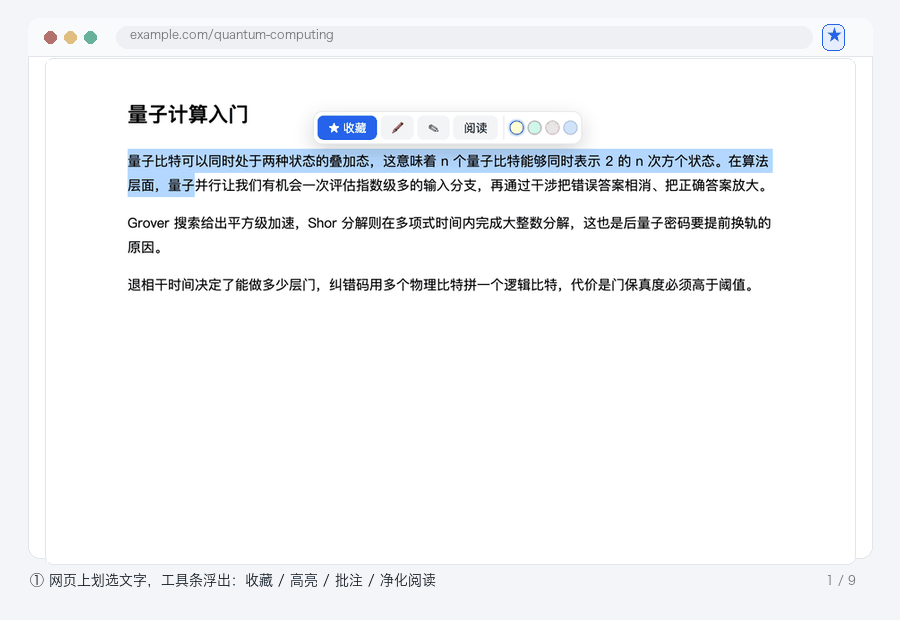

# ClipKeep ★

> **零账号 · 纯本地 · 跨浏览器** 的轻量划词收藏插件。

[](https://liuxin1985.github.io/ClipKeep/)
[](https://github.com/liuxin1985/ClipKeep/releases/latest)
[](https://github.com/liuxin1985/ClipKeep/releases/latest)

在任意网页划选文字 → 一键存本地 → 高亮批注 → 每日回顾 → 导出 Markdown → 净化阅读。
学生整理网课重点、上班族留存周报素材，开箱即用，无后端、无广告、不上传任何数据。

**划词 → 高亮批注 → 收藏 → 集中看笔记 → 删错能撤销 → 回顾打卡 → 整理标签 → 按你的模板导出 Markdown，一条链走完：**



> 动图里的每一帧都是**真实界面截图**：headless Chrome 直接加载 `extension/popup.html` 与 `content.js`，
> 由驱动脚本按用户操作走一遍（勾选、切页、按空格）后逐帧抓取。
> 重出方法见 [docs/CONTRIBUTING.md](docs/CONTRIBUTING.md) 的「更新演示动图」（`bash docs/demo/capture.sh && python3 docs/gen_demo_gif.py`）。

---

## ✨ 为什么选 ClipKeep

- **一键即用**：装上就能划词收藏，无需注册、无需配置。
- **纯本地离线**：所有数据存在浏览器 `storage.local`，永不离开你的设备。
- **外部数据当外人防**：备份里的来源地址 / 颜色 / id 都要过后台白名单清洗，`javascript:` 不会变成可点的链接。
- **跨三浏览器**：Chrome / Edge / Safari 16.4+ 全支持（同一套代码 + Safari 适配层）。
- **划词高亮 + 原文批注**：在网页上直接涂色、写批注，下次打开自动重放，点击即可修改或删除。
  两条高亮区间重叠时按边界分段渲染，交集那段套两层颜色——旧写法会让后一条被静默丢掉。
  选区跨过加粗、链接这些元素也不怕：高亮按文本节点存成锚点（每段带前后各 24 字上下文），刷新后照样一字不差地找回来。
- **四种高亮颜色**：工具条上点色块即用该色高亮并记为当前色，总览里「换色」按钮随时改色——
  重点、疑问、待办可以分色放，不必回到原网页才能重排。
- **高亮总览视图**：弹窗「🖍 高亮」按页面分组列出所有高亮与批注，可搜索、可整份导出 Markdown，
  不必回到原网页才能看自己的笔记。
- **删错了能撤销**：删除收藏 / 高亮先进回收站（保留 1 / 5 / 10 / 30 / 60 分钟自选，默认 10 分钟），
  弹窗顶部点「撤销」即可原样还原；「明细」摊开回收站里每一条，整批之外还能单独捞回某一条。
- **每日回顾**：内置 Leitner 间隔重复（0/1/3/7/21/90 天），收藏不再只进不出；
  每日上限与间隔倍率都可在 ⚙ 设置里调。
- **回顾可以全程不动鼠标**：`空格` 显示答案、`1 / 2 / 3` 打「忘记 / 记得 / 简单」，
  一条几百次的复习，键盘比挨个点按钮快得多；输入框里打字、确认弹窗开着时都不会误打分。
- **回顾热力图**：8 周打卡格子 + 「本周 / 连续天数 / 累计」统计，坚持复习这件事看得见；
  有数据的日子可以点开，看那天到底复习了哪几条。
- **图片与链接也能剪藏**：右键「收藏这张图片 / 这个链接」，带类型徽标和可点原址，
  导出成 ``，复制按钮直接给你地址。弹窗不远程加载缩略图——拉图等于把你的浏览记录交给对方服务器。
- **重复收藏提示**：同来源、同正文、同备注标签的收藏只入库一次，手滑划两次不会留下两张一样的卡片。
- **JSON 备份 / 恢复**：换电脑、换浏览器一键迁移；导入前先给你看差异
  （新增 / 相同 / 仅本地），再选「合并」「覆盖本地」或「取消」。
- **标签管理面板**：🏷 一键查看每个标签的数量，重命名、合并、删除批量生效。
- **列表批量操作**：勾选任意几条 → 批量加标签（合并去重）、批量导出、批量删除；
  「全选」跟的是**当前筛选结果**，导出的就是你看到的那一批；整批删除共用一个撤销号，一次撤销全部还原。
- **类型与站点筛选**：只看图片、只看链接、只看某个站点，chip 上带着条数，和搜索、标签取交集而不是并集；
  库里只有一种类型一个站点时筛选条根本不出现，最后一条图片被删掉后「图片」这个选项也跟着消失——不留点得动却永远筛不出东西的幽灵选项。
- **列表也能全程键盘**：`↑ / ↓` 移动焦点、`x` 勾选焦点那条、`Enter` 展开全文，配合批量操作删一排不用碰鼠标；
  按 `?`（或右上角 `?`）随时查键位，浮层里列的就是真能按的那几个。
- **搜索命中高亮**：关键词在正文、备注与来源标题里直接标黄，一眼定位。
- **快捷键秒存**：选中文字按 `Alt+Shift+K`，不用右键、不用点按钮。
- **导出 Markdown，格式由你挑**：单条或批量导出；⚙ 里可选小标题写法（编号 / 仅来源标题 / 正文首句 / 收藏时间）、
  是否带来源链接、以及 Obsidian 的 front-matter 属性块，归档不用再手改。
- **长文收藏默认折叠**：超过 240 字的收藏只显示前几行，点「展开全文」再看；
  被 2 万字上限截断的收藏带着「已截断」标记，不会假装内容存全了。
- **净化阅读**：一键移除广告、侧边栏、导航，只留正文。
- **标签分类 + 深色模式 + 一键复制**：高频小功能全覆盖。

##  快速开始（3 步）

1. [下载最新 Release 的 zip](https://github.com/liuxin1985/ClipKeep/releases/latest) 解压（或 clone 本仓库）。
2. 打开 `chrome://extensions`，右上角开启 **开发者模式**。
3. 点 **加载已解压的扩展程序**，选择 `extension/` 目录。

> 详细分浏览器安装说明见 [docs/INSTALL.md](docs/INSTALL.md)。

## 🧑‍ 使用方式

| 操作 | 方法 |
| --- | --- |
| 划词收藏 | 选中文字 → 浮动条点「★ 收藏」→（可加备注/标签）保存 |
| 划词高亮 | 选中文字 → 浮动条点「🖍」用当前色涂色，或点四个色块直接换成那个色（刷新后回到默认黄），刷新后自动恢复——选区跨过加粗 / 链接也能按文本节点分段找回来 |
| 原文批注 | 选中文字 → 浮动条点「✎」→ 写批注（粉色高亮）；点击已有高亮可改可删（输入 `!d` 删除） |
| 快捷键秒存 | 选中文字 → 按 `Alt+Shift+K`，直接入库（未选中会提示） |
| 高亮总览 | 弹窗「🖍 高亮」→ 按页面分组查看全部批注，每条可「换色」（黄→绿→粉→蓝 轮转），右上 ⬇ 导出为 Markdown |
| 撤销删除 | 删除后弹窗顶部出现撤销条 → 点「撤销」还原（整批删除一次撤销全部回来），或「清空」彻底删除（保留时长见 ⚙ 设置） |
| 回收站明细 | 撤销条点「明细」→ 摊开回收站每一条（收藏 / 高亮分色标注），单行「恢复」只捞这一条；跨批时按钮写清「撤销这批 N 条」，更早的要从这里逐条恢复 |
| 批量操作 | 列表每条右侧勾选 → 顶部出现批量条：全选 / 加标签 / 导出 / 删除 / 取消（单次上限 1000 条，超出会如实告诉你） |
| 类型与站点筛选 | 收藏列表顶部的筛选条：点「图片 / 链接 / 文字」或某个域名即只看这一类，再点一次取消；可与搜索、标签叠加 |
| 列表键盘流 | 收藏列表按 `↑ / ↓` 移动焦点 → `x` 勾选 / 取消 → `Enter` 展开或收起全文；`?` 打开键位说明，`Esc` 关闭 |
| 每日回顾 | 弹窗切到「🔁 回顾」→ 看题干 →「显示答案」→ 忘记 / 记得 / 简单，自动排下次时间 |
| 回顾键盘打分 | 「🔁 回顾」页按 `空格` 显示答案，再按 `1` 忘记 / `2` 记得 / `3` 简单，答案没揭开时数字键不动作 |
| 回顾打卡 | 「🔁 回顾」顶部的 8 周热力图：悬停看当天回顾条数，旁边是本周 / 连续天数 / 累计 |
| 打卡明细 | 点热力图里有数据的日子 → 展开当天复习了哪几条（已删除的会标出），再点一次或「收起」关闭 |
| 回顾设置 | 弹窗右上 ⚙ → 调「每日上限」1–200、「间隔倍率」0.5× / 1× / 2×、「回收站保留」分钟数 |
| 导出模板 | 弹窗右上 ⚙ → 选「导出标题样式」（编号 / 仅来源标题 / 正文首句 / 收藏时间），勾选「导出带来源链接」「Obsidian front-matter」 |
| 长文收藏 | 列表里超过 240 字的收藏默认折叠 → 卡片下方「展开全文」/「收起」 |
| 标签管理 | 弹窗工具栏 🏷 → 每行可重命名 / 合并 / 删除，数量实时显示 |
| 备份 / 恢复 | 弹窗底部「备份」导出 JSON；「恢复」选文件 → 看差异 → 合并 / 覆盖本地 / 取消 |
| 右键收藏 | 选中文字 → 右键 → 「ClipKeep：收藏选中内容」 |
| 剪藏图片 | 图片上右键 → 「ClipKeep：收藏这张图片」→ 存下原图地址 + 文件名，列表带「图片」徽标 |
| 剪藏链接 | 链接上右键 → 「ClipKeep：收藏这个链接」→ 有选字用选字当标题，否则给站点名 + 路径 |
| 净化阅读 | 浮动条点「阅读」/ 右键「净化阅读本页」/ 弹窗 📖 |
| 查看/搜索/筛选 | 点工具栏图标打开弹窗，关键词命中标黄 |
| 导出 | 弹窗右上 ⬇ 导出全部，或单条「导出」 |
| 深色模式 | 弹窗右上 🌙 / ☀️ 切换 |

## 📁 项目结构

```
ClipKeep/
├── README.md
├── LICENSE                 # MIT
├── CHANGELOG.md
├── SECURITY.md             # 数据模型 / 已知边界 / 私密漏洞报告入口
├── package.json            # 仅测试用（jsdom），扩展本身零依赖
├── .github/
│   ├── ISSUE_TEMPLATE/        # 🐞 报告问题 / ✨ 功能建议 表单 + 联系入口
│   └── PULL_REQUEST_TEMPLATE.md
├── docs/
│   ├── index.html             # GitHub Pages 在线演示页
│   ├── clipkeep-dev-plan.md   # 完整开发规划与 30 天里程碑
│   ├── INSTALL.md
│   ├── CONTRIBUTING.md
│   ├── ISSUE_TEMPLATES.md
│   ├── ci/workflow-test.yml   # 拷到 .github/workflows/ 即开启 CI
│   ├── demo/                  # 演示动图的本地桩 + 抓帧脚本（只为出图，不参与运行）
│   └── demo.gif
├── test/
│   └── clipkeep.test.mjs      # 1051 项断言：消息路由 / 快捷键 / 标签管理 / 间隔重复 / 备份恢复 / 高亮重放 / 重叠分段 / 回收站与逐条恢复 / 导出模板 / 图片与链接剪藏 / 热力图下钻 / 批量操作 / 键盘打分 / 类型与站点筛选 / 列表键盘流 / 上限与截断如实告知 / 跨节点分段锚定与锚点自洽校验 / 清单一致性
└── extension/              # 可直接加载的插件目录
    ├── manifest.json          # MV3（Chrome / Edge）
    ├── manifest.safari.json   # Safari 适配清单
    ├── background.js          # Service Worker：菜单 / 存储 / 消息路由 / 回收站 / 批量操作
    ├── content.js             # 划词工具条 / 收藏卡片 / 高亮批注 / 净化阅读
    ├── content.css
    ├── popup.html / popup.css / popup.js   # 收藏 + 高亮总览 + 回顾 / 搜索 / 标签 / 批量 / 导出 / 备份 / 撤销 / 深色
    └── icons/                 # 16 / 48 / 128
```

## 🛠 技术栈

原生 JavaScript + 浏览器 Extension API（Manifest V3）+ 手写 CSS（清爽卡片风）。
**零构建、扩展运行零依赖、零后端** —— 改完刷新即用。
高亮重放用 DOM `Range` + `TreeWalker` 按文本匹配；回顾调度用 Leitner 六盒（0/1/3/7/21/90 天）。
导出模板等偏好统一存在 `clipkeep_prefs`，写盘前逐项夹回合法枚举；外部来源地址渲染前过一次协议白名单。

## ✅ 本地开发与测试

```bash
npm install     # 只装 jsdom，用于测试
npm run check   # 语法检查三个 JS 文件
npm test        # 在 jsdom 里跑真实 popup/content/background + 清单校验，1051 项断言
```

CI 配置随仓库提供：把 `docs/ci/workflow-test.yml` 复制为 `.github/workflows/test.yml` 推送，
即可在每次 push / PR 自动跑语法检查、manifest 校验、离线（无 CDN）检查和全量测试。

## 🗺 开发路线（30 天里程碑）

- **Day 1–7 基础版 ✅**：划词监听、本地存储、浮动收藏 UI、极简列表弹窗。
- **Day 8–18 核心迭代 ✅**：Markdown 单条/批量导出、净化阅读模式、Safari tab 权限适配。
- **Day 19–30 吸星小更新 ✅**：标签分类、深色模式、一键复制、Issue 维护。
- **v1.1 复利更新 ✅**：划词高亮 + 原文批注、每日回顾（间隔重复）、JSON 备份/恢复。
- **v1.2 效率打磨 ✅**：标签管理面板、搜索命中高亮、回顾设置（上限 + 倍率）、
  恢复差异预览与「合并 / 覆盖 / 取消」、`Alt+Shift+K` 秒存选区。
- **v1.3 笔记闭环 ✅**：高亮 / 批注总览视图（按页面分组 + 导出 Markdown）、
  删除可撤销回收站（10 分钟）、备份导入的 id / 颜色注入过滤、
  存储写入统一走后台串行链（跨标签页不再互相覆盖）、清单一致性测试把关。
- **v1.4 看得见的坚持 ✅**：回顾热力图与打卡统计（后台与排期同一步落盘）、
  回收站保留时长可设置、重复收藏提示；备份导入在后台再洗一道（非数组标签 / 重复 id / 越界盒号），
  操作提示不再说谎，拖选与净化阅读不再和高亮标记打架。
- **v1.5 导出成型 ✅**：导出模板自定义（标题样式四选一 / 来源链接开关 / Obsidian front-matter）、
  超长收藏默认折叠 +「已截断」标记；修掉来源地址直接当链接渲染的注入入口、
  URL 带括号把导出链接写断、热力图「本周」的时区偏差与「连续天数」被今天清零。
- **v1.6 剪藏扩边界 ✅**：图片与链接右键剪藏（类型徽标 + 可点原址 + Markdown 图片语法，弹窗不远程加载缩略图）、
  热力图格子下钻当天复习明细（活动记录升级为 `{ n, ids }`，旧数字记录照样读）、高亮颜色选择器（工具条色块选色即高亮、总览一键换色）；
  修掉回顾卡片漏过的来源协议白名单、`clipkeep:update` 的开放合并、超长地址被截成另一个地址、打卡明细无渲染上限。
- **v1.7 批量与键盘 ✅**：收藏列表批量选择与操作（勾选 / 全选当前筛选结果 → 批量加标签合并去重、批量导出、
  批量删除，整批共用一个撤销号，单次上限 1000 条且超出如实告知）、回顾全程键盘打分（`空格` 看答案、`1 / 2 / 3` 忘记 / 记得 / 简单）、
  演示动图改为真实界面截图（附可复现的抓取管线 `docs/demo/`）、仓库治理（Issue 表单 / PR 模板 / SECURITY.md）；
  修掉弹窗写操作连点重复入库（删除 / 加标签 / 批量 / 撤销全部上锁）、撤销提示报不出真实还原条数。
- **v1.8 找得到 ✅**：收藏列表按类型与站点筛选（chip 带条数、只列库里真存在的值、与搜索标签取交集、
  筛空时如实说「筛选后没有结果」而不是「还没有收藏」）、列表全程键盘流（`↑ / ↓` 焦点、`x` 勾选、`Enter` 展开、`?` 键位说明）、
  演示动图补上筛选与键盘流帧；修掉筛选 / 标签 chip 重绘后焦点掉回页面顶部。
- **v1.9 重叠与逐条 ✅**：重叠高亮按区间边界分段渲染（部分相交不再静默丢一条，交集那段套两层），
  同一条高亮的多个片段一起删、一起改批注；回收站新增「明细」，整批撤销之外能逐条捞回，
  撤销按钮写清只管最近这一批；修掉整批撤销不先清过期（弹窗开着不动就能让过期条目复活）。
- **v1.10 跨节点锚定 ✅（当前）**：高亮按文本节点拆成分段锚点（每段带前后各 24 字上下文，段序必须递增、
  拼起来必须正好等于正文），选区跨过加粗 / 链接刷新后也能一字不差找回来；锚点拼不回可见正文时宁可不存锚点，
  也不把 `display:none` 这类用户没见过的字写进正文；正文被 2 万字上限砍短时，提示当场说明「已截断」。
- **v1.11 规划中**：英文 UI 与国际化文案层、整段盖住整个文本节点时的文档级上下文锚定（这种短段目前只会落到页面里第一处同名文本）。

完整拆解与每阶段 AI 开发 Prompt 见 [docs/clipkeep-dev-plan.md](docs/clipkeep-dev-plan.md)。

## 🤝 参与贡献

欢迎 Issue 与 PR！提 PR 前请先读 [docs/CONTRIBUTING.md](docs/CONTRIBUTING.md)。
如果 ClipKeep 帮到了你，点个 **Star** ⭐ 是最好的支持。

## 📄 许可证

[MIT](LICENSE) © ClipKeep contributors
